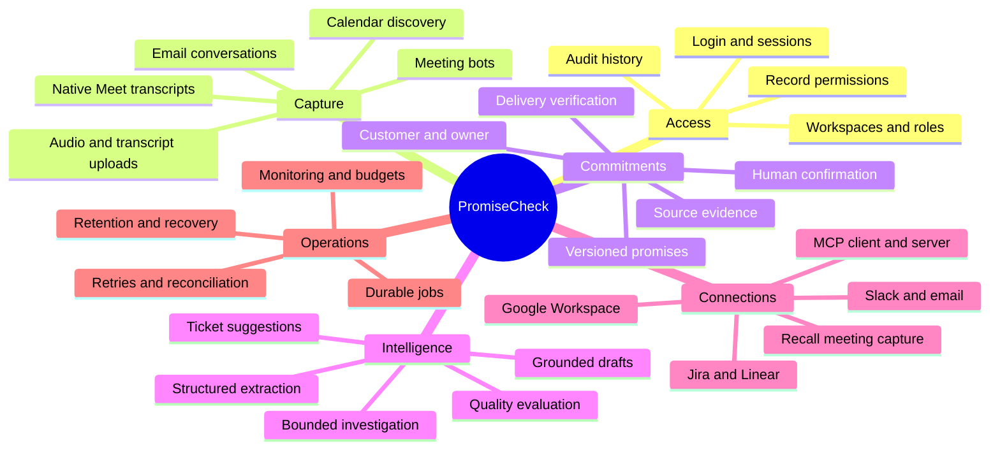
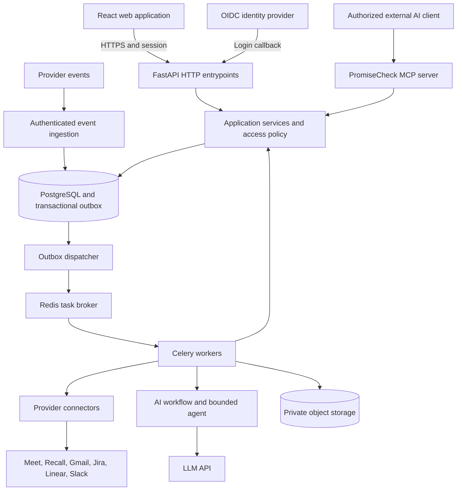

# PromiseCheck

**Customer commitments, connected from conversation to verified delivery.**

PromiseCheck helps SaaS teams capture promises made to customers, assign accountable owners, connect promises to engineering work, detect delivery conflicts, and communicate changes before trust is damaged.

> **Project status:** implementation blueprint, dated September 10, 2026. The conversation has produced product designs and visual mockups; it has not produced a running application, verified integrations, or a deployed service. This documentation defines the full required product. The proposed folders, routes, configuration, and commands are implementation contracts, not claims that those files or capabilities already exist.
>
> **Scope commitment:** MCP, real integrations, permissions, operational reliability, and end-to-end delivery verification are required release capabilities. Phases describe build order, not features that may be silently dropped. Each customer enables only the integrations they authorize; product support for the integration is still required.

## Contents

- [Product and example](#product-and-example)
- [Product mind map](#product-mind-map)
- [Full release scope](#full-release-scope)
- [Screens and user journeys](#screens-and-user-journeys)
- [System overview](#system-overview)
- [Core modules](#core-modules)
- [Integration catalog](#integration-catalog)
- [AI and MCP](#ai-and-mcp)
- [Scalable repository layout](#scalable-repository-layout)
- [Development and configuration](#development-and-configuration)
- [Build sequence and release gates](#build-sequence-and-release-gates)
- [Documentation and references](#documentation-and-references)

## Product and example

Sales promises Acme that SSO will be enabled by September 30. An engineering ticket targets October 5. PromiseCheck retains the original quote, links the ticket, identifies the five-day conflict, and alerts the owner. The owner can investigate, approve a customer update, revise the commitment with history, and eventually attach evidence that SSO is available to Acme.

A ticket marked Done does not by itself prove that a customer can use a feature. A suggested date is not automatically a confirmed promise. Missing engineering data means delivery confidence is unknown.

Primary users: sales, customer success, engineering leads, account owners, and workspace administrators. Customers are records in the initial product; they are not automatically workspace users or recipients.

## Product mind map



## Full release scope

| Area | Required result |
| --- | --- |
| Identity | OIDC login, server sessions, secure logout, invitations, membership lifecycle, administrative MFA through the identity provider. |
| Access | Workspace isolation, roles, record grants, source visibility, server-enforced permissions on HTTP, jobs, search, and MCP. |
| Capture | Native Google Meet ingestion, Recall-based Meet/Zoom/Teams capture, transcript upload, audio upload with speech-to-text, selected Gmail conversations, Calendar meeting discovery. |
| Review | Candidate promises, uncertain speaker/customer/date review, confirmed ticket links, rejected candidates, immutable revision history. |
| Engineering | Jira and Linear initial sync, change processing, date-field mapping, blockers, multiple tickets per promise, fresh-state reconciliation. |
| Risk | Date conflicts, approaching deadlines, overdue promises, blockers, missing delivery information, stale evidence, configurable escalation. |
| Communication | Slack and email internal alerts, grouped notifications, delivery status, approval-gated customer updates. |
| Delivery | Release/enablement evidence attachment, owner verification, delivered and reopened states. |
| AI | Structured extraction, semantic matching, bounded tool-using investigation, evidence-grounded drafting, regression evaluation. |
| MCP | Authenticated remote PromiseCheck server and a controlled client gateway for explicitly configured external MCP servers. |
| Operations | Durable jobs, retry limits, connection repair, quotas, observability, exports, deletion, backups, restore tests, deployment and rollback. |

“All integrations” means the explicit catalog below and the common connector framework. It does not imply every vendor on the internet, automatic authorization, or capabilities a provider does not expose. New vendors enter the same documented onboarding and acceptance process.

## Screens and user journeys

| Screen | Required functionality |
| --- | --- |
| Landing page | Product explanation, supported integrations, sign-in and onboarding entry. |
| Onboarding | Create or join workspace, assign initial admin, choose timezone and retention, connect providers, map fields and customers. |
| Overview | Active commitments, risk totals, review backlog, upcoming deadlines, clearly stated count definitions. |
| Commitments | Search, filters, customer/owner/date/status columns, paginated results and detail drawer. |
| Commitment details | Exact quotes, evidence links, ticket status and freshness, revision history, risks, owner actions and approved drafts. |
| Customers | Account identity, reviewed domain mappings, owners, customer timeline and access grants. |
| Review queue | Confirm/edit/reject candidates, resolve ambiguous dates and links, group possible duplicates. |
| Meetings and imports | Capture schedules, capture consent status, upload progress, waiting/failed/ready transcript states. |
| Integrations | Connection owner, selected resources, granted scopes, last sync, reconnection and disconnect controls. |
| Notifications | Alert history, failed delivery, preferences, approved recipients and approval queue. |
| Workspace settings | Roles, invitations, retention, quotas, audit, MCP client grants and external server allowlist. |

### End-to-end user journey

1. Sign in and create or join a workspace.
2. An authorized admin connects approved accounts; a resource owner separately authorizes private source access when required.
3. Choose meeting capture rules, source-sharing policy, ticket projects, delivery-field mapping, and notification destinations.
4. Ingest a real transcript or email. AI extracts candidates with source evidence.
5. A reviewer confirms customer, owner, deadline, conditions, and engineering links.
6. Risk evaluation uses confirmed information and current ticket snapshots.
7. Relevant changes create an internal alert. An investigation agent can gather authorized evidence and draft an update.
8. A permitted reviewer approves the exact customer message and recipient before sending.
9. The owner records verified delivery, or revises the promise without erasing history.
10. Users and authorized MCP clients can retrieve the same permission-filtered records.

## System overview



The scheduler inserts durable work for reconciliation, subscription renewal, deadlines, and retention. The web browser never receives provider refresh tokens or LLM API keys. The API accepts work quickly and exposes job status. HTTP and MCP share application services and authorization. Workers scale independently from request-serving processes.

## Core modules

| Module | Owns |
| --- | --- |
| `identity` | Identity links, sessions and login callbacks. |
| `workspaces` | Memberships, invitations, roles, teams, record grants. |
| `integrations` | Credentials references, selected resources, sync cursors, subscriptions and connector lifecycle. |
| `ingestion` | Event receipts, uploaded source records, normalized segments and import jobs. |
| `customers` | Accounts, identities, reviewed domain mapping and assigned owners. |
| `commitments` | Candidates, confirmed promises, evidence links, immutable revisions and transitions. |
| `engineering` | Ticket snapshots, project configuration, delivery-field mapping and dependencies. |
| `risk` | Current risk assessments and deterministic evaluation policy. |
| `delivery` | Release/customer enablement evidence and verified fulfillment. |
| `notifications` | Internal alerts, exact message approvals, recipients and delivery attempts. |
| `ai` | Extraction, retrieval, matching, investigation, drafts, prompt/model versions and evaluations. |
| `mcp` | Server tools, client gateway, authorization context, external server configuration and contracts. |
| `audit` | Append-only application audit events and privileged access records. |
| `operations` | Jobs, outbox, quotas, scheduling, retention and operational status. |

## Integration catalog

Every connector below is a required product deliverable. A customer may use only its chosen capture route; the system must not start multiple recorders for a meeting by default.

| Integration | Purpose | Connection and data flow | Completion evidence |
| --- | --- | --- | --- |
| Google identity / configured OIDC provider | Login | Authorization-code flow, PKCE, validated callback, server session. | Login, logout, invitation and invalid-token tests. |
| Google Calendar | Discover selected meetings and scheduled capture | User-authorized API access; maintain event identity and time changes. | Selected meeting is scheduled, rescheduled and canceled correctly. |
| Google Meet | Retrieve native generated transcripts | User OAuth; Workspace Events through Pub/Sub; fetch entries and reconcile. | Real authorized meeting transcript imports with speaker/time evidence. |
| Google Drive | Import authorized Meet artifacts and user-selected files | Scope-minimized access; retain original source ID and permissions. | Eligible file imports; denied/revoked access remains denied. |
| Recall.ai | Meeting capture and transcription for Meet, Zoom, Teams | Backend provider key; configured bot capture; provider events and artifact retrieval. | Controlled real meetings captured on each platform, including admission failure. |
| Transcript upload | Import exported conversations | Authenticated upload, file validation, normalization. | Supported formats and malformed files are tested. |
| Audio upload / speech-to-text | Convert authorized recordings | Private upload; worker invokes configured hosted speech provider. | Supported audio produces evidence segments; unsupported files fail clearly. |
| Gmail | Extract commitments from selected email conversations | Separate consent and selection; cursor/history synchronization with reconciliation. | Thread revision and duplicate message handled without duplicate commitment. |
| Jira | Engineering truth | OAuth, selected projects, paginated import, events and periodic reconciliation. | Real ticket update changes linked risk; removed permissions revoke visibility. |
| Linear | Alternative engineering tracker | OAuth, selected teams/projects, paginated import, events and reconciliation. | Same normalized ticket contract and risk tests as Jira. |
| Slack | Internal alerts | Workspace app authorization and approved destinations. | Message delivery, destination denial and retry behavior verified. |
| Email delivery | Internal alerts and approved customer updates | Backend mail adapter with delivery receipts where supported. | Exact approval, bounce handling and ambiguous-send recovery tested. |
| MCP server | Expose PromiseCheck to external AI clients | Authenticated remote transport; tool-level scopes and record checks. | Authorized client completes read and approved mutation scenarios. |
| MCP client gateway | Agent access to configured external tools | Admin allowlist, server authentication, capability contract and scoped tool execution. | At least one real configured server passes contract, denial and timeout tests. |

Provider registration, credentials, OAuth verification, account eligibility, webhook capabilities and recording access are external launch dependencies. The product must show these prerequisites honestly. It must never fabricate a transcript or label synthetic data as a successful live integration.

## AI and MCP

The routine pipeline is explicit: normalize source, extract candidates, validate evidence, suggest matches, request review, evaluate confirmed records, create alerts. The investigation agent is invoked for ambiguous matching or an explicit investigation/draft request; it has a bounded number of read-tool calls and a controlled draft-writing capability.

The initial agent budget is six tool calls, 60 seconds, and a configured token/cost cap per run. These are initial limits to tune from measurements. Exhaustion produces an incomplete investigation state, not an invented answer.

Required internal tools include `get_commitment`, `search_allowed_tickets`, `get_ticket_details`, `get_source_excerpt`, `get_delivery_evidence`, and `save_update_draft`. The backend injects actor and workspace context; the model cannot choose a different tenant.

Required external MCP tools include `list_commitments`, `get_commitment_evidence`, `list_at_risk_commitments`, `investigate_commitment`, `create_update_draft`, and permission-scoped review/delivery actions. External send and review mutations require the same approval workflow as the dashboard. Tool descriptions are not permission grants.

MCP is a required interface in this product, but provider event ingestion and scheduled synchronization continue to run through durable connectors. MCP cannot create provider access that was never granted.

## Scalable repository layout

The following is the **proposed repository structure**. Indentation indicates ownership; these directories are not created by this documentation deliverable. The application is a modular monolith, with API, worker, scheduler, dispatcher and MCP process entrypoints sharing one domain codebase.

```text
promisecheck/
  README.md
  architecture.md
  .env.example
  .gitignore
  compose.yaml
  Makefile
  apps/
    web/
      package.json
      src/
        app/                   routing, session bootstrap, providers
        features/
          auth/
          onboarding/
          overview/
          commitments/
          customers/
          reviews/
          meetings/
          integrations/
          notifications/
          settings/
        components/ui/         reusable accessible visual components
        api/generated/         client generated from OpenAPI
        lib/                   HTTP transport, dates, error handling
        styles/
      tests/
        components/
        e2e/
    backend/
      pyproject.toml
      alembic.ini
      migrations/versions/
      src/promisecheck/
        entrypoints/
          api.py
          worker.py
          scheduler.py
          dispatcher.py
          mcp_server.py
        bootstrap/             dependency wiring and module registration
        platform/
          config/
          database/
          security/
          secrets/
          storage/
          messaging/
          telemetry/
          http/
        modules/
          identity/
          workspaces/
          integrations/
          ingestion/
          customers/
          commitments/
          engineering/
          risk/
          delivery/
          notifications/
          ai/
          mcp/
          audit/
          operations/
        connectors/
          contracts/
          google_calendar/
          google_meet/
          google_drive/
          gmail/
          recall/
          speech_to_text/
          jira/
          linear/
          slack/
          email/
          external_mcp/
      tests/
        unit/
        integration/
        contracts/
        authorization/
        workflows/
        recovery/
  packages/
    contracts/
      openapi/
      events/
      mcp/
  evaluations/
    datasets/                  consented or synthetic, classified by source
    expected/
    runners/
    reports/
  infrastructure/
    containers/
    terraform/
      modules/
      environments/
        staging/
        production/
    observability/
  scripts/
    development/
    migration/
    backup_restore/
  docs/
    integrations/
    runbooks/
    adr/
    security/
  .github/workflows/
```

### Inside a business module

```text
modules/commitments/
  domain/
    entities.py
    value_objects.py
    policies.py
    events.py
    errors.py
  application/
    commands.py
    queries.py
    handlers.py
    ports.py
  infrastructure/
    models.py
    repositories.py
    event_handlers.py
  presentation/
    routes.py
    schemas.py
```

Dependency rule: presentation calls application; application uses domain and abstract ports; infrastructure implements ports. Domain code must not import FastAPI, Celery, provider SDKs or an LLM client. Connectors translate provider data and errors into application contracts. Cross-module changes go through application interfaces or versioned events, not another module's ORM internals.

Frontend features own their views, queries and state. Shared UI components contain no customer or commitment business rules. Generated API clients must not be edited manually.

## Development and configuration

### Chosen implementation baseline

| Layer | Baseline |
| --- | --- |
| Frontend | React, TypeScript, Vite, query cache, accessible component system. |
| Backend | Python, FastAPI, Pydantic, SQLAlchemy, Alembic. |
| Durable data | PostgreSQL; permission-filtered full-text search, with pgvector for semantic retrieval when implemented as part of matching. |
| Background work | Celery with Redis broker, PostgreSQL job ledger and transactional outbox. |
| Files | Private S3-compatible object storage and short-lived authorized download URLs. |
| AI | Hosted LLM and hosted speech-to-text adapters; pinned model identifiers and versioned prompts. |
| Interfaces | Versioned REST/OpenAPI, provider event endpoints, authenticated MCP over supported remote HTTP transport. |
| Deployment | Containerized backend processes, static frontend delivery, managed database and broker, infrastructure as code. |
| Operations | OpenTelemetry instrumentation, metrics, structured redacted logs, alerts and backup restoration. |

Pin supported dependency versions in lockfiles during implementation. No package versions or cloud account resources are claimed to exist in this document.

### Configuration contract

| Group | Proposed keys | Handling |
| --- | --- | --- |
| App | `APP_ENV`, `PUBLIC_APP_URL`, `API_BASE_URL`, `DEFAULT_TIMEZONE` | Non-secret configuration. |
| Identity | `OIDC_ISSUER`, `OIDC_CLIENT_ID`, `OIDC_CLIENT_SECRET`, `SESSION_SIGNING_KEY` | Secret values remain server-side. |
| Data | `DATABASE_URL`, `REDIS_URL`, `OBJECT_STORAGE_BUCKET`, `OBJECT_STORAGE_ENDPOINT` | Credentials from secret manager or workload identity. |
| Encryption | `KMS_KEY_ID` | Envelope encryption for provider tokens. |
| Google | `GOOGLE_CLIENT_ID`, `GOOGLE_CLIENT_SECRET`, `GOOGLE_PUBSUB_TOPIC`, `GOOGLE_PUBSUB_AUDIENCE` | Scopes configured per selected capability. |
| Capture | `RECALL_API_KEY`, `RECALL_REGION`, `SPEECH_PROVIDER`, `SPEECH_API_KEY` | Capture access and tenant usage budgets required. |
| Trackers | `JIRA_CLIENT_ID`, `JIRA_CLIENT_SECRET`, `LINEAR_CLIENT_ID`, `LINEAR_CLIENT_SECRET` | Per-connection OAuth grants stored encrypted. |
| Alerts | `SLACK_CLIENT_ID`, `SLACK_CLIENT_SECRET`, `SLACK_SIGNING_SECRET`, `EMAIL_PROVIDER_API_KEY` | Per-destination access and sending policy. |
| AI | `LLM_PROVIDER`, `LLM_MODEL`, `LLM_API_KEY`, `EMBEDDING_MODEL`, `AI_RUN_COST_LIMIT` | Server-only values; no production transcript logging. |
| MCP | `MCP_PUBLIC_URL`, `MCP_AUTH_ISSUER`, `MCP_AUDIENCE` | Tenant-specific external server configurations in database. |
| Monitoring | `OTEL_EXPORTER_OTLP_ENDPOINT`, `ERROR_REPORTING_DSN` | Redaction before export. |

Never commit real `.env` files. `.env.example` must contain placeholder values and descriptions only. React build variables are public and must not contain secrets.

### Expected startup experience after implementation

The repository must provide documented commands for dependency installation, local infrastructure, database migrations, API startup, worker startup, scheduler/dispatcher startup, frontend startup, and MCP startup. A future `make dev` should orchestrate these processes, but **it is not executable in this documentation-only deliverable**.

Local development uses one low-concurrency worker and small synthetic datasets. Real integrations are tested with authorized development accounts. On an 8 GB machine, use hosted LLM/speech APIs and run focused integration scenarios; run sustained load and recovery tests in a staging environment.

The web deployment should expose frontend and `/api` through the same site origin where feasible. Provider callback URLs need a reachable HTTPS development/staging endpoint registered with the provider. Local-only services cannot receive arbitrary public callbacks without an approved ingress route.

### API contract outline

| Route family | Responsibility |
| --- | --- |
| `/api/v1/auth/*` | Login callback, session status and logout. |
| `/api/v1/workspaces/*` | Membership and configuration. |
| `/api/v1/integrations/*` | Authorize, select resources, status, reconnect, disconnect. |
| `/api/v1/uploads/*` | Upload creation, completion and validation. |
| `/api/v1/meetings/*` | Capture, transcript and import status. |
| `/api/v1/customers/*` | Accounts, owners and reviewed mappings. |
| `/api/v1/commitments/*` | Search, review, revision, evidence and delivery. |
| `/api/v1/notifications/*` | Draft, approval, delivery state and preferences. |
| `/api/v1/jobs/*` | Permission-filtered progress and retry status. |
| `/events/{provider}` | Provider-specific authenticated delivery, independent of browser sessions. |
| `/mcp` | MCP entrypoint using dedicated resource-server authorization. |

Long tasks return `202 Accepted` with an authorized job resource. Mutations use idempotency keys where repetition could create duplicate business actions and expected record versions where stale updates matter.

## Build sequence and release gates

Every phase is mandatory for the full release.

| Phase | Deliverables | Exit gate |
| --- | --- | --- |
| 1. Foundation | Repository, CI, auth, membership, data model, policy, audit. | Cross-workspace and role tests pass. |
| 2. Source pipeline | Uploads, event ledger, outbox, workers, normalized evidence. | Retries and duplicate deliveries preserve one logical result. |
| 3. Promise workflow | Extraction, customer mapping, review, revisions, search. | Evaluation targets and review workflow pass. |
| 4. Real sources | Meet, Calendar, Drive, Gmail, Recall on all three platforms, audio speech service. | Authorized real-source acceptance per catalog. |
| 5. Delivery monitoring | Jira and Linear, field mapping, risks, deadlines, delivery evidence. | Real ticket changes and verified fulfillment work end-to-end. |
| 6. Communication | Slack, email, exact draft approval, failure recovery. | No external send without valid approval; ambiguous sends handled. |
| 7. Agent and MCP | Bounded investigation, MCP server, controlled MCP client. | Tool authorization and external-client end-to-end tests pass. |
| 8. Production readiness | Performance, accessibility, observability, retention, recovery, deployment. | SLO evidence, restored backup, security review and rollback drill. |

### Definition of done

- [ ] Every functional requirement in `architecture.md` has implementation and acceptance evidence.
- [ ] Every catalog integration passes live authorized acceptance and failure scenarios.
- [ ] Native Meet access and meeting bot access are represented honestly in onboarding.
- [ ] MCP works with a real authorized client and the controlled external-server gateway.
- [ ] Dashboard, REST and MCP produce equivalent permission-filtered business results.
- [ ] Original evidence and human changes remain traceable without unrestricted transcript exposure.
- [ ] Duplicate, delayed and revoked-access scenarios are tested.
- [ ] Customer delivery is verified separately from ticket completion.
- [ ] No production completion is asserted from synthetic-only tests or screenshots.
- [ ] Backup restoration, retention deletion, deployment and rollback are demonstrated.

## Documentation and references

Read [architecture.md](architecture.md) for functional and non-functional requirements, access policy, data design, service contracts, sequence diagrams, failure handling, MCP security and architectural decisions.

Provider details below were consulted in the preceding design discussion on September 10, 2026. Revalidate exact scopes, protocol versions, event schemas, regional endpoints and provider approval requirements during connector implementation. These documents are paraphrased, not reproduced.

- [Google Meet artifacts](https://developers.google.com/workspace/meet/api/guides/artifacts)
- [Google Meet authorization](https://developers.google.com/workspace/meet/api/guides/authenticate-authorize)
- [Google Meet events](https://developers.google.com/workspace/events/guides/events-meet)
- [Google Meet event delivery](https://developers.google.com/workspace/meet/api/guides/events-overview)
- [Recall transcription](https://docs.recall.ai/docs/transcription)
- [Jira delegated OAuth](https://developer.atlassian.com/cloud/jira/platform/oauth-2-3lo-apps/)
- [MCP architecture](https://modelcontextprotocol.io/docs/learn/architecture)
