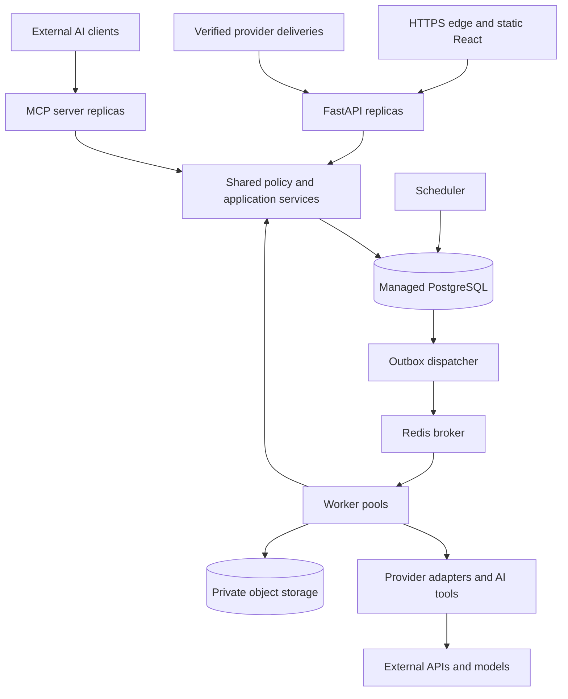
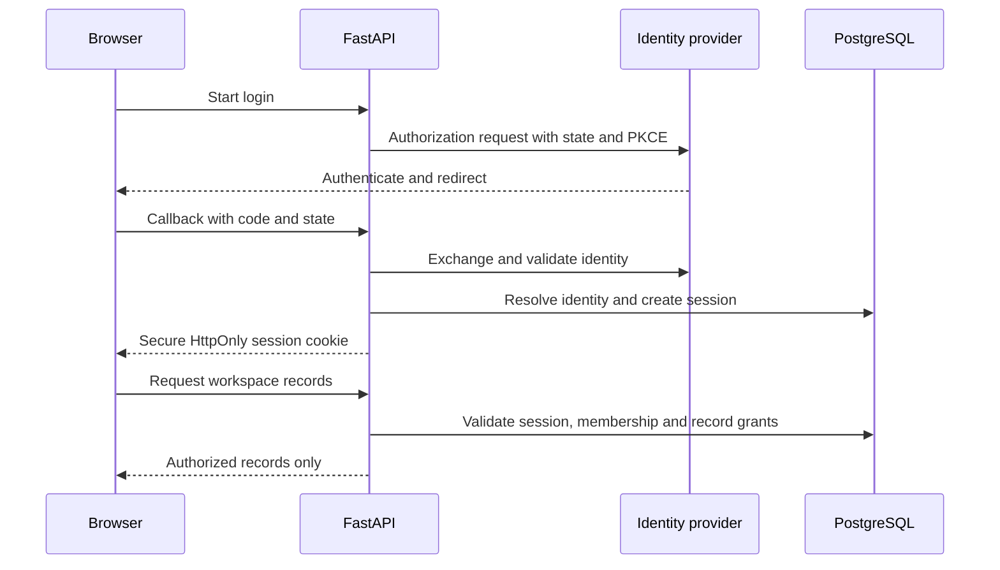
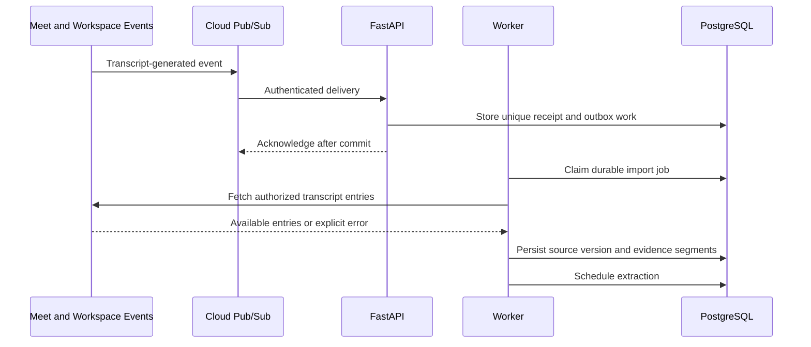
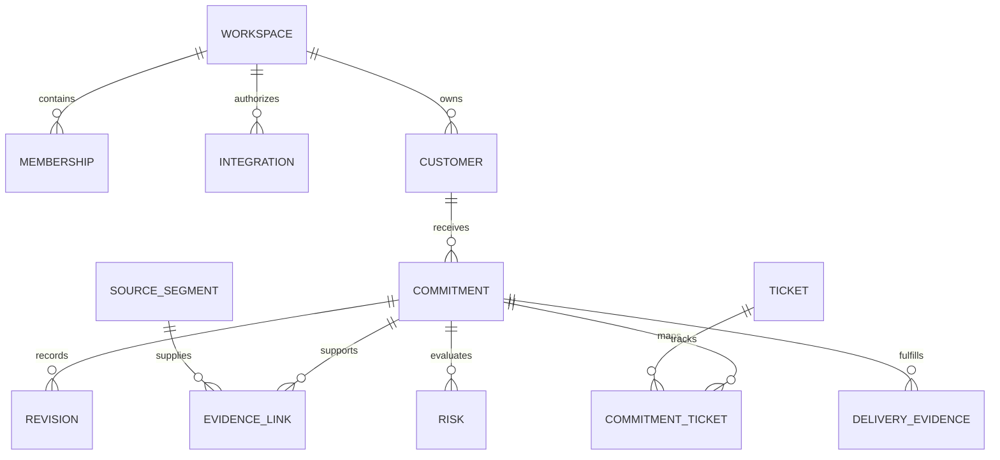
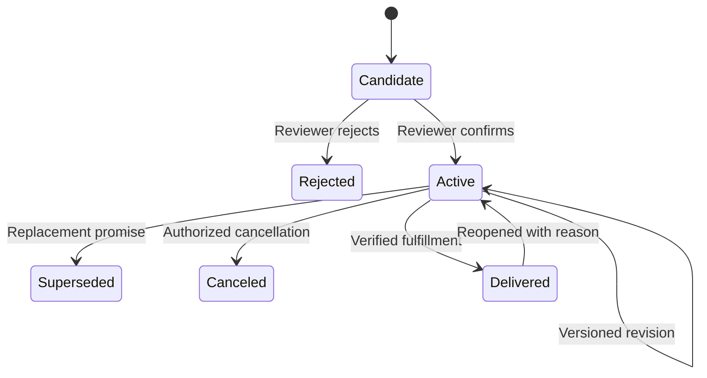
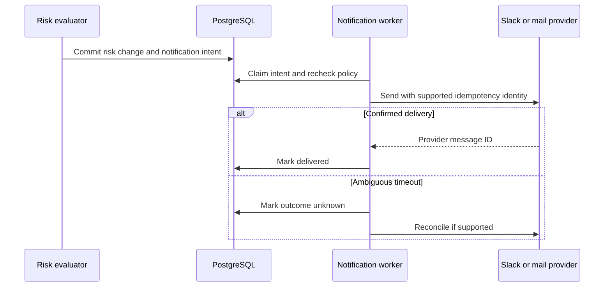

# PromiseCheck Architecture

**Status:** target architecture for implementation, September 10, 2026. No running system or measured production performance is claimed. All requirements below belong to the full release, including MCP server/client integration and the catalog in [README.md](README.md).

## 1. Architecture goals and boundaries

Build a multi-tenant SaaS that turns authorized conversations into reviewed customer commitments, monitors engineering evidence, detects conflicts, and supports approved communication through verified delivery.

The architecture must preserve source evidence, uncertainty, ownership, tenant isolation and change history. It must continue functioning when providers fail or deliver duplicate events. AI interpretation is bounded by application policy. Product completeness means a verified end-to-end workflow, not a collection of connected logos.

External dependencies include identity services, provider accounts, consent, meeting admission, usable transcripts, OAuth app approval, API limits, network access and customer-configured ticket fields. Missing dependencies produce explicit setup, waiting or reconnect states. They do not justify generated replacement evidence.

### Scope interpretation

The required provider catalog is Google identity/OIDC, Calendar, native Meet, Drive, Gmail, Recall capture for Meet/Zoom/Teams, uploaded transcripts/audio, speech-to-text, Jira, Linear, Slack, email delivery, PromiseCheck MCP server and controlled external MCP client integration. Google Workspace scopes and implementation approvals are determined per capability. New integrations require a connector contract and acceptance tests before being advertised.

A customer does not need to connect every provider. Product support is mandatory; customer authorization and use remain deliberate. Capture routing selects one authorized route per meeting, with explicit fallback rules to avoid duplicate recording and billing.

## 2. Functional requirements

| ID | Requirement | Acceptance evidence |
| --- | --- | --- |
| FR-01 | OIDC login, sessions, logout and invitation acceptance. | Valid identity succeeds; expired/replayed callback and session fail. |
| FR-02 | Workspace membership, roles, team and record grants. | A user cannot read or mutate another tenant through any interface. |
| FR-03 | Provider connect, resource selection, refresh, reconnect and disconnect. | Grant lifecycle and revoked access exercised per connector. |
| FR-04 | Discover and schedule authorized meeting capture. | Calendar cancellation/rescheduling updates capture without duplication. |
| FR-05 | Native Meet transcripts, Recall across three meeting platforms, uploads and speech conversion. | Real-source ingestion plus missing transcript, denied admission and malformed upload cases. |
| FR-06 | Selected Gmail thread ingestion and updates. | Duplicate/revised emails preserve stable source identity and review history. |
| FR-07 | Normalize source segments and preserve evidence lineage. | Every extracted quote resolves to an immutable source version and segment. |
| FR-08 | Extract candidate promises with conditions and uncertainty. | Reviewed evaluation set meets NFR quality thresholds. |
| FR-09 | Confirm customer, speaker, accountable owner, deadline and ticket links. | Ambiguous data blocks confirmation until resolved or explicitly left unknown. |
| FR-10 | Revise, reject, supersede, cancel, deliver and reopen commitments. | Expected-version protection prevents lost updates; history remains available. |
| FR-11 | Synchronize Jira and Linear with configured delivery fields and dependencies. | Changed ticket triggers only affected commitment reevaluation. |
| FR-12 | Deterministic risks and deadlines. | Conflicts, missing dates, blockers and stale data have distinct outcomes. |
| FR-13 | Notify approved internal Slack/email destinations with deduplication and grouping. | Retry does not blindly repeat a previously delivered notification. |
| FR-14 | Investigate and draft customer updates with exact approval before sending. | Changing content or recipient invalidates prior approval. |
| FR-15 | Verify fulfillment using release/enablement evidence and owner attestation. | Ticket Done alone never automatically sets Delivered. |
| FR-16 | Search, filters, detail views, customer history and review queue. | Results and snippets respect permissions; counts match defined filters. |
| FR-17 | Authenticated PromiseCheck MCP tools. | Real client exercises reads, long-job status and scoped mutations. |
| FR-18 | Controlled external MCP gateway for the investigation agent. | Allowlisted server works; unapproved server/tool and missing scope are denied. |
| FR-19 | Durable jobs, status, operator retry and reconciliation. | Worker/broker failure does not lose accepted business work. |
| FR-20 | Audit, usage budgets, retention, export and deletion. | Deletion propagates to files, embeddings, caches and pending work. |
| FR-21 | Deployment, backup, restore, monitoring and incident workflows. | Staging restore and rollback drills recorded before production readiness. |

## 3. Non-functional requirements

These are initial design targets, not observed results. Load tests must use a declared workload and record infrastructure, payload distribution, external provider latency and concurrency.

### Workload assumptions

Initial production sizing envelope: 100 workspaces, 1,000 registered users, 100 concurrent interactive sessions, 2,000 transcripts/day, 100,000 tracked tickets and peak inbound delivery of 50 events/second for five minutes. Typical meeting is 60 minutes; test up to 120 minutes and a configured 200 MB audio limit. These are planning assumptions to refine with usage and cost measurements.

| ID | Attribute | Target and measurement |
| --- | --- | --- |
| NFR-01 | Interactive latency | p95 under 500 ms for standard database-backed API reads; exclude uploads, exports and provider calls. |
| NFR-02 | Availability | 99.5% monthly for authenticated core app operations; include failures of dependencies needed to serve those operations. Report provider sync availability separately. |
| NFR-03 | Transcript processing | p95 within 5 minutes after the transcript is available to our system for supported typical workload. Provider transcript generation time is measured separately. |
| NFR-04 | Ticket freshness | p95 risk reevaluation within 2 minutes of receiving a valid event. Reconciliation aims to catch missed changes within 15 minutes subject to provider quotas. |
| NFR-05 | Job durability | No acknowledged event lost after a single API/worker/broker process restart under normal durable database operation. Regional disaster loss bound is NFR-09. |
| NFR-06 | Isolation | Zero unauthorized cross-tenant access in automated negative tests across REST, MCP, workers, search, exports and files. |
| NFR-07 | Extraction quality | Initial gate: precision at least 95%, recall at least 85%, and exact normalized date accuracy at least 95% on dated, unambiguous examples. |
| NFR-08 | Grounding | 100% of confirmed machine-extracted promises have validated evidence references. At least 90% top-3 ticket retrieval recall on labeled matching cases; reviewer confirmation remains required for uncertain matches. |
| NFR-09 | Recovery | RPO at most 15 minutes; RTO at most 4 hours for the declared disaster scenario. Demonstrate restore, credential access and outbox resumption. |
| NFR-10 | Accessibility | Target WCAG 2.2 AA: keyboard use, focus visibility, labels, contrast, understandable errors and status conveyed beyond color. |
| NFR-11 | Cost control | Per-workspace capture minutes, tokens, job concurrency and notification budgets enforced; configured budget exhaustion creates explicit paused state. |
| NFR-12 | Observability | Every job has correlation ID, source ID, workspace context, attempt count and outcome without raw transcript text in routine telemetry. |
| NFR-13 | Deletion | Active-system deletion completes within 24 hours under normal operation; backups expire within 35 days under the stated retention policy. |

Quality metrics use a frozen, reviewed dataset with at least 300 source examples across promises, suggestions, conditions, quoted speech, revisions and ambiguous dates. Split by customer/conversation to prevent leakage. Report sample counts, failure categories and confidence intervals; do not imply a small test proves universal accuracy. Evaluate representative languages before advertising support.

## 4. Component and deployment architecture



Production runs API, MCP, workers, scheduler and dispatcher independently from the same versioned backend image. Frontend assets are delivered through an edge/CDN. Database and broker reside on private networks. Public ingress exposes only required HTTPS endpoints. Workload identity and a secret manager provide service credentials; clients never access database/broker ports.

Use infrastructure as code with separate staging and production accounts/resources. Start with one regional deployment and a documented regional recovery plan. Scale worker pools for ingestion, AI and delivery independently. Use database leases/advisory locks for scheduler ownership and dispatcher claiming; do not assume only one process exists forever.

Telemetry and secret management are cross-cutting services omitted from the diagram for readability.

## 5. Authentication and authorization

### Login sequence



Use a mature OIDC library. Validate issuer, audience, signature, expiry, nonce and state. Identity is keyed by issuer plus subject, not by display name. Do not silently merge identities or admit a person to a workspace based only on matching email domain. Invitations are expiring, single-use and tied to verified intended identity. Require identity-provider MFA for administrators.

Use server-side sessions with revocation and idle/absolute expiry. Cookie-authenticated mutations require CSRF protection; CORS is not authorization. Same-origin frontend/API simplifies cookie handling. Logout invalidates the server session. Membership removal takes effect at the next request/tool call, not only at next login.

### Authorization policy

Access requires valid identity, active membership, permitted action, resource grant, and compatible source visibility. Deny by default. Workspace admins manage configuration but are not implicitly granted every private source. Background work acts as an explicitly scoped service principal on behalf of an integration, preserving source restrictions.

| Action | Admin | Manager | Member | Viewer |
| --- | --- | --- | --- | --- |
| Manage memberships/connections | Yes | No | No | No |
| Read records | Granted records | Granted records | Granted records | Granted records |
| Review/revise | Granted records | Assigned teams | Assigned records | No |
| Approve customer sending | Granted records | Assigned teams | No | No |
| Change retention/policy | Yes | No | No | No |
| Operate MCP tools | Same action and record rules | Same rules | Same rules | Read only |

Put `workspace_id` on business rows and include it in foreign-key relationships or equivalent database constraints. Use PostgreSQL row-level security as defense in depth with transaction-local tenant context and a non-bypass application role. Clear tenant context when returning pooled connections. Administrative maintenance uses a separate tightly controlled role and audit trail.

Search must filter candidates before returning snippets or sending context to a model. Cache keys include tenant and relevant authorization version. Short-lived file URLs are issued only after policy evaluation. Revocation invalidates grants and caches and prevents pending jobs from using obsolete access. Provider-side ACL changes may require polling; fail closed when access cannot be revalidated for sensitive source evidence.

## 6. Integration design

### Two separate grants

Application login proves identity. Provider OAuth permits selected operations on external data. Linking an account does not grant all its data to every workspace member. The connection records authorizing user, provider account, workspace, granted scopes, selected resources, sharing policy, credential reference, expiry and sync state.

OAuth callbacks validate a one-time state bound to session, workspace and intended provider. Refresh tokens are encrypted using envelope encryption; logs never contain tokens or callback codes. Handle concurrent refresh through a per-connection lock and atomically replace rotated credentials.

### Native Google Meet sequence



The native API retrieves generated artifacts; it does not reconstruct an untranscribed meeting. Plan to import within the provider retention window; Google documents that API transcript entries are removed 30 days after the conference. Native capture depends on account eligibility, settings and user access. Workspace events use Pub/Sub and require appropriate subscription lifecycle management. See [Meet artifacts](https://developers.google.com/workspace/meet/api/guides/artifacts) and [events](https://developers.google.com/workspace/events/guides/events-meet).

Direct Meet entry retrieval and Drive file download can require different scopes. Resolve scopes per endpoint and minimize access; public Google app verification is a release dependency. See [Meet authorization](https://developers.google.com/workspace/meet/api/guides/authenticate-authorize).

### Bot and upload capture

Recall connector creates an authorized capture job for an eligible selected meeting, tracks admission/recording/transcription states, and retrieves final artifacts. Persist capture authorization and participant-notice configuration. Admission refusal or recording restrictions remain visible failures. Provider keys never go to React. Recall documents bot-based transcription and final artifact retrieval in its [transcription guide](https://docs.recall.ai/docs/transcription).

Upload flow: authorize actor and quota, issue a private upload destination, validate actual media type and size, quarantine/scan files, normalize or invoke speech-to-text, then schedule extraction. Reject unsupported content and avoid fetching arbitrary user-supplied URLs. Presigned destinations are server-selected and short-lived.

### Connector contract

Each adapter supplies supported operations for `authorize`, `refresh`, `list_resources`, `initial_sync`, `fetch_current`, `normalize`, `verify_event`, `reconcile`, `renew_subscription`, and `disconnect`. Capability flags declare unsupported operations; do not fake a webhook when polling is the available route. Maintain versioned JSON/schema contracts and tests for each adapter.

External data normalizes into source documents/segments, engineering tickets, participants, and notification delivery results. Preserve provider ID, account ID, source version, timestamps, permissions and last successful fetch. Never normalize unknown dates to today's date or missing owners to the uploading user.

Verify provider events using the mechanism that provider actually supports: signed payloads, authenticated push tokens or documented shared-secret controls. Validate Pub/Sub token issuer/audience and permitted delivery identity. When event authenticity is limited, treat payloads only as hints and fetch authorized current state before mutation. Apply payload limits and rate limiting.

The source is authoritative for external fields. PromiseCheck owns reviewed mappings, business promises and internal risk records. Out-of-order events trigger current-state fetches and version checks. Deletion events create tombstones and remove affected access; missed deletions are caught by reconciliation.

## 7. Data model and state



Additional operational tables: `users`, `identity_links`, `sessions`, `invitations`, `teams`, `record_grants`, `source_documents`, `source_versions`, `capture_jobs`, `ingestion_events`, `jobs`, `outbox`, `agent_runs`, `tool_calls`, `notification_drafts`, `approvals`, `notification_attempts`, `audit_events`, `mcp_grants`, `external_mcp_servers` and `deletion_jobs`.

Essential constraints:

- Unique integration event receipt on connection/provider/event ID; use a documented canonical fingerprint when no event ID exists.
- External records unique by workspace, connection and provider record ID, not just a title.
- Immutable evidence source version and segment offsets; user edits create a new version.
- Commitment revision numbers are monotonic; commands require expected current version.
- Ticket links are many-to-many with reviewed confidence and required-delivery semantics.
- Date-only promises retain a date and workspace/customer timezone; do not invent a midnight UTC timestamp. Resolve relative dates against source time and reviewed timezone.
- Risk assessment references commitment revision, ticket versions, evaluator version and freshness.
- Approved message stores exact content hash, recipients, approver and commitment version.

Lifecycle and risk are separate dimensions. `active`, `delivered`, `canceled` and `superseded` describe the commitment lifecycle; `at_risk`, `overdue`, `blocked`, `unknown` and `stale` describe current assessments and may overlap. Dashboard “At risk” is an explicitly documented umbrella count of distinct active commitments with actionable risk, not a sum of overlapping badges.



A canceled/superseded promise remains in history. Absence of risk is not a guarantee of on-time delivery.

## 8. AI processing and deterministic decisions

### Extraction contract

Return structured candidates containing source version, segment IDs, exact quote, customer candidates, speaker identity, accountable-owner candidates, promised outcome, explicit/relative deadline, conditions, and uncertainty reasons. Parse using a strict schema. Validate quote spans against the source. Invalid results receive bounded retry and then a failed/review state.

Chunk long transcripts with overlap and preserve global segment IDs. Merge candidates using evidence spans and semantic identity; repeated statements are not automatically new promises. Retractions and changed deadlines become revision candidates requiring review. Speaker identity and accountable owner are separate fields.

### Retrieval and matching

Filter by tenant, source policy, selected project and customer access before lexical/vector retrieval. Store embedding model/version. Rank candidates from normalized ticket data and preserve match explanations. Confirmation is required before uncertain matches drive customer-facing action. Embeddings and generated summaries inherit source access and deletion policy.

### Bounded agent

The investigation agent can retrieve permitted evidence and create a draft. Initial budget: six tool calls, 60 seconds, configured model/token cap. Each tool receives trusted server actor/workspace context. Output is a concise evidence-grounded explanation with references and unresolved questions. Persist tool names, authorized input references, outputs needed for audit and final decision evidence; do not require private chain-of-thought storage.

The tool gateway validates arguments, checks permissions, executes the action and validates results. It restricts network destinations and never exposes arbitrary SQL, shell execution, arbitrary HTTP fetch or unrestricted provider tokens. Transcript/tool text is untrusted content and cannot override system policy.

### Rule engine

| Condition | Outcome |
| --- | --- |
| Confirmed delivery target later than promised date | Date conflict with exact difference. |
| Promise deadline passed and fulfillment unverified | Overdue. |
| Required linked work has a configured blocking dependency | Blocked, with evidence. |
| Missing ticket/date/owner information | Unknown or needs review, not fabricated risk certainty. |
| Evidence exceeds freshness threshold | Stale; display last successful sync. |
| Ticket marked Done but release/customer enablement unverified | Awaiting delivery verification. |

For multiple required tickets, compare the latest known required delivery target only when all necessary targets are available. Missing targets retain unknown confidence. Calendar deadlines and permitted notification hours use configured timezones. No LLM is needed for arithmetic, RBAC, job retries or duplicate detection.

## 9. MCP architecture and required contracts

MCP is required in the final product. It standardizes AI tool/context access; it is not the durable provider ingestion layer. Reference: [official MCP architecture](https://modelcontextprotocol.io/docs/learn/architecture). Pin a supported protocol/SDK version during implementation and test compatibility; avoid hardcoding assumptions from a different protocol revision.

### Inbound MCP server

Expose a dedicated remote endpoint as an OAuth-protected resource. Validate token issuer, signature, audience, expiry and scopes, then resolve active user membership and resource grants. Browser cookies are not a substitute for MCP client authorization. Never pass an incoming MCP bearer token through to Google/Jira. Provider tokens are separate grants resolved by the backend.

| Tool | Required scope | Execution |
| --- | --- | --- |
| `list_commitments` | `commitments:read` | Paginated permission-filtered query. |
| `get_commitment_evidence` | `evidence:read` | Source grant checked before excerpts. |
| `list_at_risk_commitments` | `commitments:read` | Distinct commitments with current assessments. |
| `investigate_commitment` | `investigations:create` | Returns durable job ID; budgeted agent. |
| `get_job_status` | Corresponding resource access | No cross-user/tenant job leakage. |
| `create_update_draft` | `drafts:write` | Creates unsent versioned draft. |
| `review_commitment` | `commitments:review` | Reviewer role, expected revision, explicit confirmation. |
| `record_delivery_evidence` | `delivery:write` | Validate evidence and actor authority. |
| `approve_update` | `notifications:approve` | Exact message/recipient approval and policy-required human interaction. |
| `send_approved_update` | `notifications:send` | Valid unconsumed approval, fresh record version and idempotency key. |

An AI client cannot impersonate a human approval by simply invoking the tool. Approval uses an authenticated human confirmation record bound to exact content, recipient and relevant revision. Tokens/scopes cannot expand the user's underlying role. Provide machine-readable errors for unauthenticated, forbidden, stale-version, approval-required, quota-exceeded and provider-unavailable outcomes without exposing forbidden resource details.

### Outbound MCP client gateway

Admins configure approved server endpoints, capabilities and credential grants. Validate destinations against SSRF and internal-network access rules; constrain redirects, response size and call duration. Discover tools, compare them to an approved capability manifest and deny newly introduced tools until reviewed. Treat server output and tool descriptions as untrusted content.

Use scoped per-user or explicitly authorized service credentials. Validate every call in the same tool gateway as internal tools. Log server identity and tool version. An MCP provider outage yields an incomplete investigation; it cannot disable core commitment reads or deterministic monitoring.

## 10. Durable events, jobs and notifications

Example versioned internal event:

```json
{
  "event_id": "evt_example",
  "event_type": "engineering.ticket.updated.v1",
  "workspace_id": "ws_example",
  "aggregate_id": "ticket_example",
  "aggregate_version": 8,
  "occurred_at": "2026-09-24T10:00:00Z",
  "correlation_id": "corr_example",
  "payload": {"changed_fields": ["target_delivery_date"]}
}
```

Payloads reference protected data rather than embedding full transcripts. Consumers are versioned and tolerate compatible additive fields. Unknown major schema versions go to a reviewable failure queue.

Persist inbound receipt and scheduled outbox event in one database transaction; acknowledge the provider only after commit. Dispatch with at-least-once semantics. Workers claim durable jobs with leases, heartbeat long processing, record attempts, and commit business state plus follow-up outbox work atomically. A stale-lease recovery process requeues unfinished jobs. There is no claim of globally exactly-once delivery.

### Notification sequence



Provider idempotency is capability-dependent. A timeout after send may mean the message was delivered. Where the provider cannot reconcile or deduplicate, mark the attempt unknown for review instead of automatically sending again. Deduplicate internal intents using commitment revision, risk transition, destination and notification policy version. Reminders have explicit time-window keys.

Sending to customer recipients always requires exact approval. Changing draft content, recipients or relevant commitment revision invalidates approval. Internal automated alerts require configured destination authorization and policy, not per-alert approval. Do not include private evidence in broad channels; send a permission-checked link when audience compatibility is uncertain.

## 11. Failure handling

| Failure | Required behavior |
| --- | --- |
| No native transcript generated | Waiting/unavailable state; offer authorized upload or configured capture route for future meetings. |
| Bot denied admission | Stop capture, expose failure, avoid fake completion. |
| Provider token revoked | Pause connector, invalidate access as appropriate, ask connection owner to reconnect. |
| Subscription expires | Renew before expiry, detect expiration, reconcile missed interval. |
| Provider rate limit | Honor retry hints, backoff with jitter and per-tenant/provider concurrency limits. |
| Duplicate event | Reuse receipt identity and avoid repeated logical work. |
| Out-of-order event | Fetch current state, compare versions and discard obsolete transition. |
| LLM unavailable or malformed output | Bounded retry; preserve source; surface failed/review job. |
| Queue unavailable | Keep outbox pending and alert on lag. |
| Worker dies mid-job | Lease expires and durable recovery reschedules safely. |
| Database unavailable | Do not acknowledge durable acceptance; provider may retry. |
| Stale reviewer update | Return conflict with current revision and require review. |
| External send outcome unknown | Reconcile or human review; no blind resend. |
| Deleted source or permissions | Apply visibility/deletion policy to excerpts, embeddings and derived records. |

## 12. Data protection and lifecycle

Default product policy proposal: source transcript/audio retained 90 days, business commitment history 365 days, audit metadata 365 days, backups 35 days. Customers can choose shorter retention; longer retention needs an explicit supported policy and cost evaluation. These are product defaults, not legal compliance claims.

Separate temporary upload objects from accepted artifacts. Use encryption in transit and at rest; restrict keys and bucket access to required workloads. Keep secret values and raw conversation text out of analytics, errors and model tracing by default. Send only necessary authorized excerpts to AI providers with configured retention settings suitable for the customer.

Deletion creates a durable tombstone, cancels pending extraction/agent work, removes or redacts affected source data, deletes embeddings/caches/exports and records minimal non-content audit metadata. Derived commitment data follows the approved retention policy; it cannot retain a deleted private quote accidentally. Backups expire on schedule. A restore must replay deletion tombstones before restored data is exposed to users.

## 13. Observability, deployment and validation

Metrics: API latency/error rates, age of oldest outbox item, queue lag, job success/retry rate, transcript availability delay, integration freshness, refresh failures, agent cost, extraction review outcomes, notification unknown states and deletion backlog. Alerts have named owners and runbooks. Correlation IDs connect ingestion, extraction, review, ticket changes and notifications.

CI must run formatting/type checks, domain tests, authorization negatives, API/MCP contract checks, migration checks, dependency/secret scans and a small fixed AI regression suite. Staging runs live provider acceptance, user journeys, larger quality evaluations, load tests and failure injection. Use provider development accounts and consented data; synthetic fixtures remain labelled.

Deploy immutable images with a release manifest. Apply backward-compatible expand/contract database migrations. Roll out consumers compatible with both event versions before changing producers. Drain workers on shutdown and retain active-job leases for recovery. Rollback must not assume every database migration can be reversed; destructive changes require forward recovery or a tested restore procedure.

Required release evidence: real upload-to-delivery flow, native Meet flow, bot capture on all three platforms, Gmail ingestion, Jira and Linear updates, Slack/email approval behavior, inbound/outbound MCP scenarios, access denial across every interface, expired grants, duplicate/out-of-order events, worker restart, ambiguous send, deletion propagation and backup restoration.

## 14. Architectural decisions

All decisions are accepted for the target design, not asserted to be implemented.

| ADR | Decision | Reason and consequence | Revisit trigger |
| --- | --- | --- | --- |
| 001 | Modular monolith with separate process entrypoints. | Shared rules and fewer distributed transactions; enforce module boundaries. | Independent teams or measured deployment/scaling bottleneck. |
| 002 | React frontend and FastAPI backend. | Matches project stack and supports typed HTTP contracts. | Measured requirement that this stack cannot satisfy. |
| 003 | OIDC login and server sessions. | Central identity lifecycle and server-controlled revocation; requires CSRF handling. | Additional native/mobile client requirements. |
| 004 | RBAC plus record/source grants and tenant defense in depth. | Roles alone cannot protect private meeting evidence. | Policy complexity exceeds maintainable shared evaluator. |
| 005 | Native transcripts, bot capture and uploads all supported. | Covers different customer source availability; increases connector testing burden. | Provider capability or customer need changes. |
| 006 | Provider adapters normalize into internal contracts. | Prevent provider-specific fields from spreading into domain code. | Contract no longer represents necessary semantics. |
| 007 | PostgreSQL ledger/outbox plus Celery/Redis. | Durable intent despite broker/process failure; requires leases and deduplication. | Measured queue throughput or operational needs justify another broker. |
| 008 | AI proposes, reviewed state and code govern actions. | Evidence and human judgment handle ambiguity; adds review workload. | Evaluated narrow cases support policy-approved automation. |
| 009 | MCP server and controlled MCP client are required. | Supports external assistants and agent tools through common authorization. | Protocol or provider changes require adapter updates. |
| 010 | Exact approval for customer sending. | Keeps audience/content deliberate and traceable; introduces approval state. | Explicit product policy change with acceptance evidence. |
| 011 | Source and ticket freshness are first-class data. | Prevents stale snapshots from appearing authoritative. | Provider latency or access model changes. |
| 012 | Delivery verification is distinct from ticket completion. | Customer availability may lag engineering work. | Reliable customer-specific enablement signals permit automated verification. |
| 013 | Hosted model and speech APIs behind ports. | Keeps local resource demands modest and permits provider replacement. | Cost, data-residency or latency evidence supports self-hosting. |
| 014 | Full release scope with sequential acceptance gates. | Build order manages complexity without omitting MCP/integrations. | User explicitly approves a changed product scope. |

## 15. Implementation completion checklist

- [ ] Trace each FR to module, API/tool, test and demo evidence.
- [ ] Measure NFR targets using the declared workload and report deviations.
- [ ] Pin provider contracts, scopes, endpoints, SDKs and MCP protocol version.
- [ ] Verify required accounts and provider approvals before promising live access.
- [ ] Implement and test all catalog adapters including revocation and reconciliation.
- [ ] Confirm record/source policy consistency across REST, MCP, workers and search.
- [ ] Demonstrate agent limits and evidence validation under adversarial input.
- [ ] Demonstrate human approval binding and unknown-send recovery.
- [ ] Restore a backup, replay deletion records, resume outbox and verify access.
- [ ] Complete accessibility and user workflow checks on the implemented UI.
- [ ] Replace documentation status with implemented/verified status only when supported by evidence.

The full project is complete only when these requirements and the README release gates are satisfied. Screenshots, integration stubs and synthetic-only demonstrations do not satisfy the production acceptance definition.
